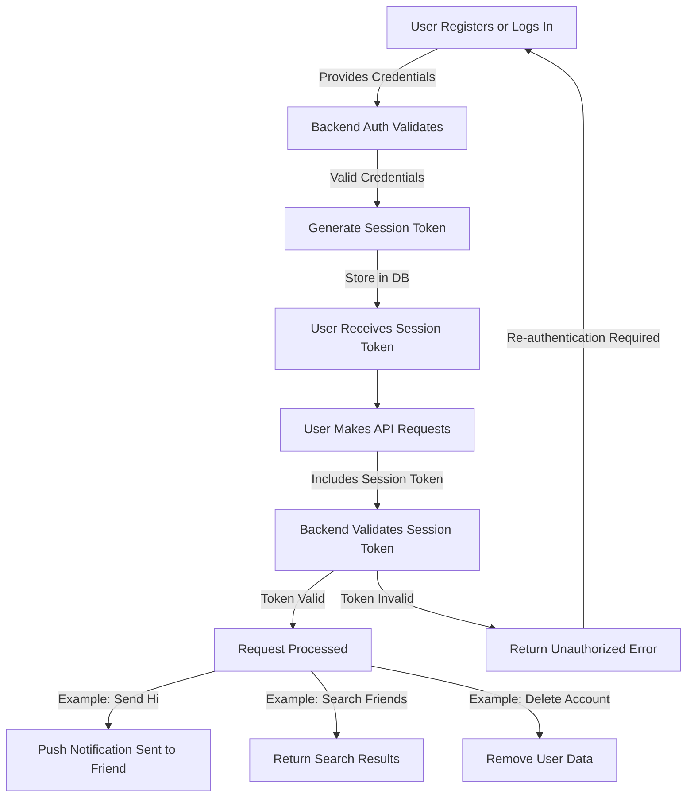

# YO!

```mermaid
graph TD
    A[User Registers or Logs In] -->|Provides Credentials| B[Backend Auth Validates]
    B -->|Valid Credentials| C[Generate Session Token]
    C -->|Store in DB| D[User Receives Session Token]
    D --> E[User Makes API Requests]
    E -->|Includes Session Token| F[Backend Validates Session Token]
    F -->|Token Valid| G[Request Processed]
    F -->|Token Invalid| H[Return Unauthorized Error]
    G -->|Example: Send Hi| I[Push Notification Sent to Friend]
    G -->|Example: Search Friends| J[Return Search Results]
    G -->|Example: Delete Account| K[Remove User Data]
    H -->|Re-authentication Required| A
```
