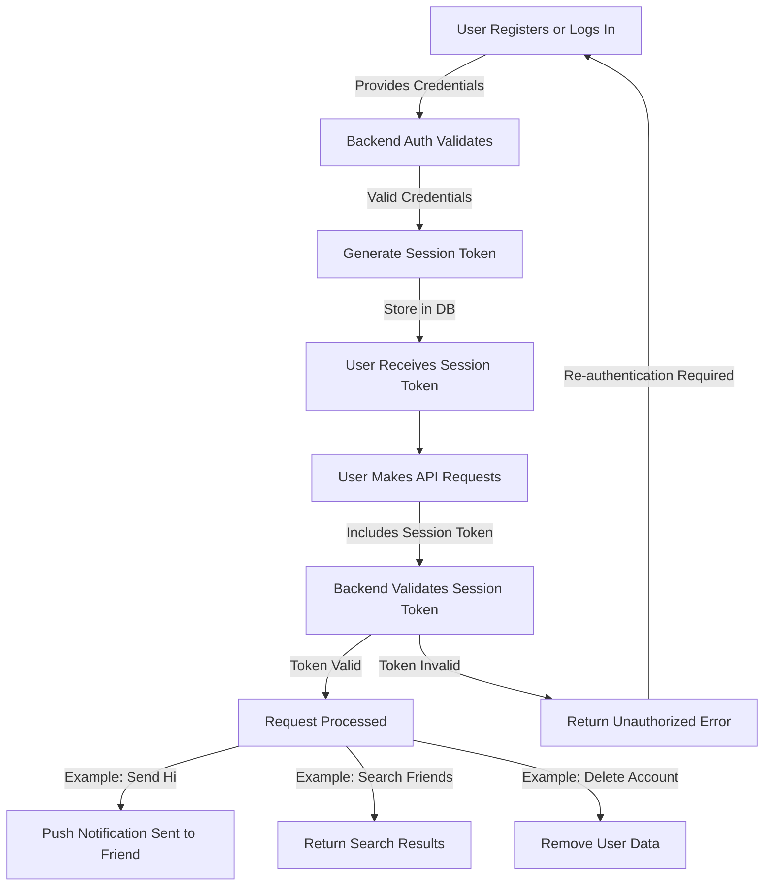

# YO!

## App Flow



## Database Schema

````mermaid
erDiagram
    USERS {
        int id PK
        varchar email
        varchar username
        varchar passwordHash
        timestamp createdAt
    }
    FRIENDS {
        int id PK
        int userId FK
        int friendId FK
        timestamp createdAt
    }
    MESSAGES {
        int id PK
        int senderId FK
        int receiverId FK
        text message
        timestamp sentAt
    }
    SESSIONS {
        int id PK
        int userId FK
        varchar sessionToken
        timestamp createdAt
        timestamp expiresAt
    }

    USERS ||--o{ FRIENDS : "has many friends"
    USERS ||--o{ MESSAGES : "sends many messages"
    USERS ||--o{ SESSIONS : "has many sessions"
    FRIENDS ||--|| USERS : "links to a user"
    FRIENDS ||--|| USERS : "links to a friend"
    MESSAGES ||--|| USERS : "sent by a user"
    MESSAGES ||--|| USERS : "received by a user"
    ```
````
